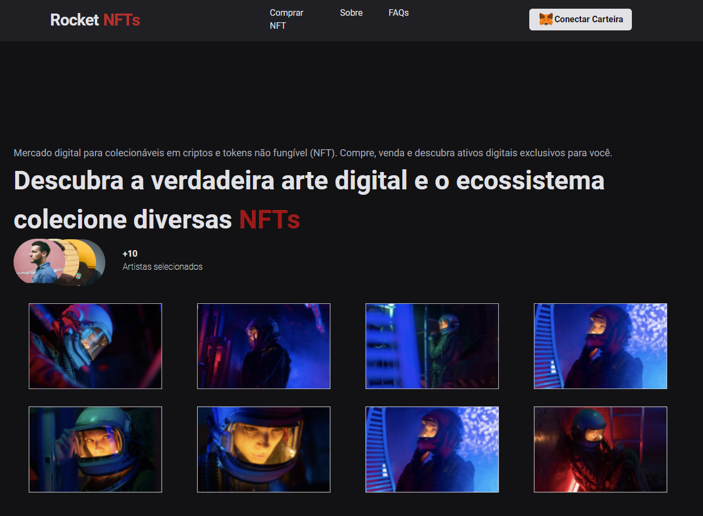
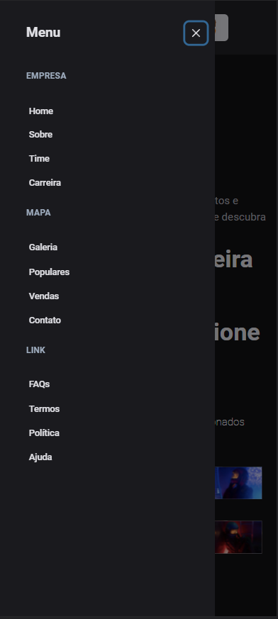

<h1 align="center">
     
</h1>
<div align="center">
    
     
    
     
</div>
    
<p align="center">   
    
</p>
<p align="center">
  <a href="#sobre">Sobre</a>&nbsp;&nbsp;&nbsp;|&nbsp;&nbsp;&nbsp;
  <a href="#tecnologias">Tecnologias</a>&nbsp;&nbsp;&nbsp;|&nbsp;&nbsp;&nbsp;
  <a href="#como-executar">Como Executar</a>&nbsp;&nbsp;&nbsp;|&nbsp;&nbsp;&nbsp; 
</p>

## Sobre

O **Rocket NFTs** é uma aplicação Web.

## Tecnologias

- [Typescript](https://www.typescriptlang.org/)
- [NextJS](https://nextjs.org/)
- [Chakra-ui](https://chakra-ui.com/)
- [GraphQL](https://graphql.org/)
- [GraphCMS](https://www.graphcms.com/)

## Como Executar

- ### **Pré-requisitos**

  - É **necessário** possuir o **[Node.js](https://nodejs.org/en/)** instalado no computador
  - É **necessário** possuir o **[Git](https://git-scm.com/)** instalado e configurado no computador
  - Também, é **preciso** ter um gerenciador de pacotes seja o **[NPM](https://www.npmjs.com/)** ou **[Yarn](https://yarnpkg.com/)**.
  - Por fim, é **essencial** ter o **[Expo](https://expo.io/)** instalado de forma global na máquina

1. Faça um clone do repositório:

```sh
  $ git remote add origin https://github.com/aleksanderpalamar/rocket-nft.git
```

2. Executando a Aplicação:

```sh
  # Aplicação web
  $ cd rocket-nft
  # Instalando as dependências do projeto.
  $ yarn # ou npm install
  # Inicie a aplicação web
  $ yarn dev # ou npm dev
```

---
<sup>Projeto desenvolvido por [Aleksander Palamar](https://github.com/aleksanderpalamar), da [Blog](https://app.linuxupdate.com.br).</sup>
